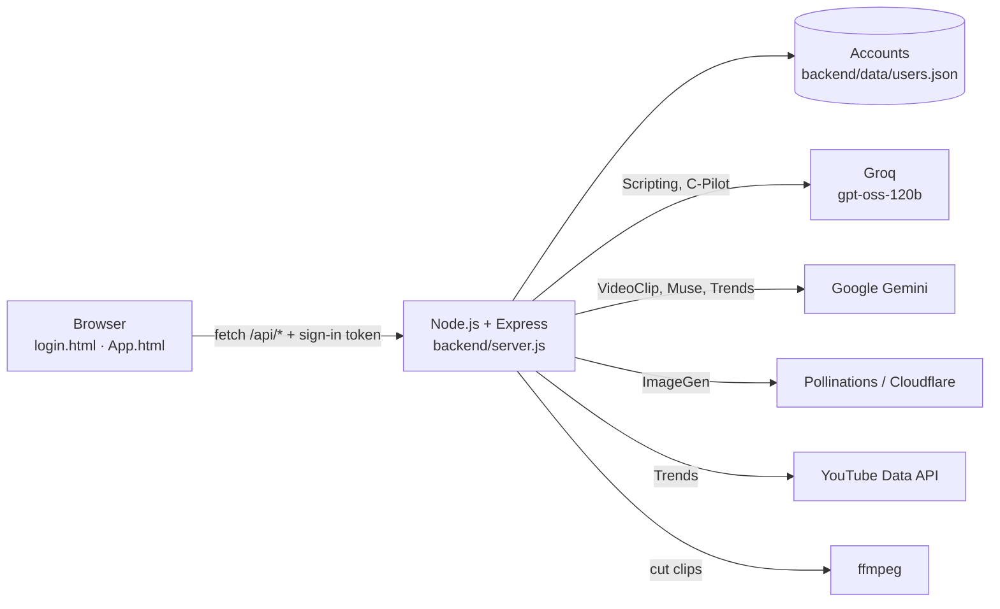

# BIT-N-BUILD-RADIENCE
Repo for team RADIENCE for bit n build

<div align="center">

# INFLUX

**An AI studio for creators, built like a tablet.**
Write scripts, make visuals, cut long videos into short clips, get honest feedback,
see what's trending and ask a growth co-pilot, tuned for **Instagram**, **LinkedIn** and **YouTube**.


</div>

---

## What's inside

INFLUX opens like a tablet: a home screen with your name, widgets and six apps. Tap an app and it opens full screen. Every app has an Instagram / LinkedIn / YouTube switch that changes the format, prompts and output for that platform.

| App | What it does | Powered by |
|---|---|---|
| **Scripting** | Turns an idea into a ready-to-film script: hook, shot-by-shot script, call to action, caption and hashtags. Pick tone and length. | Groq (`gpt-oss-120b`) |
| **ImageGen** | Post visuals and thumbnails, framed for the platform (4:5, 1:1 or 16:9). Keeps a history for the session. | Pollinations (free) or Cloudflare Workers AI |
| **VideoClip** | Upload a long video. AI watches it, picks the strongest self-contained moments, and cuts them into clips (vertical 9:16 for Reels and Shorts). | Gemini + ffmpeg |
| **Muse** | Feedback before you post: upload a thumbnail and/or paste a caption. Get what works, the top 3 fixes, a rewritten hook and an engagement score. | Gemini (vision) |
| **Trends** | Trend explorer with top topic, hashtag, sound and format; topics by category with momentum; hashtags to copy; plus the **live YouTube trending chart**. | Gemini + YouTube Data API |
| **C-Pilot** | A chat co-pilot for new creators: best times to post, how often, which formats reach more, how to get the first 1,000 followers. | Groq (`gpt-oss-120b`) |

Apps hand work to each other: **Trends → Script this trend**, **Scripting → Make a visual**, **ImageGen → Get feedback in Muse**.

## Screenshots

| | |
|---|---|
|  |  |
| **Log in / create account** | **Scripting**: a Reel script written by AI |
|  |  |
| **Trends** with the live YouTube chart | **C-Pilot** remembers the conversation |
|  |  |
| **Muse**: score and fixes for a post | **Home**: greeting and AI engine status |

## Highlights

- **Platform-aware everything.** Each prompt carries platform rules (Reel hooks, LinkedIn's "see more" cut-off, YouTube thumbnail and Shorts limits), so output fits where it's going.
- **Accounts.** Register and log in; the home screen greets you ("Hello, Sai — how would you like to influence today?"). Passwords are hashed with scrypt; the AI tools only work for signed-in users.
- **Tablet interface.** Apps zoom out of their icons, there's a dock, a status bar and a home bar. The tablet grows to fill the window, and the room around it glows with the colours on screen, changing to each app's colour as you open it. On phones it goes full screen.
- **Runs on free tiers.** Gemini and Groq free keys cover every tool; images work with no key at all.
- **Ready for live demos.** If Gemini is busy, the server retries and falls back to a lighter model, and errors are shown in plain language. An "AI engines" widget shows which keys are working.
- **Honest data.** Trends never invents view counts or growth percentages: momentum is labelled as an AI estimate, and the only numbers shown are real ones from YouTube.

## How it works



The browser never sees an API key. The frontend is plain HTML, CSS and JavaScript (no framework, no build step); the Node.js server serves the pages, checks the sign-in token and calls the AI services.

**Tech:** HTML · CSS · vanilla JavaScript · Node.js 20+ · Express · `openai` SDK (pointed at Groq) · `@google/genai` · ffmpeg-static · multer · marked + DOMPurify

## Getting started

### 1. Requirements

- [Node.js](https://nodejs.org) **20 or newer** (the LTS version is fine)
- Free API keys (see step 3). Login works without any keys.

### 2. Install and run

**Windows:** double-click **`start.bat`**. It installs everything the first time, starts the server and opens the browser.
**macOS / Linux:** run `./start.sh`.
**Or from a terminal in the project folder:**

```bash
npm install
npm start
```

Open **http://localhost:3000**, create an account, and you're in. Keep the terminal open while you use INFLUX: closing it stops the server.

### 3. Add your API keys

The first start creates `backend/.env` from [`backend/.env.example`](backend/.env.example). Fill in the keys and restart; the terminal shows which tools are ready.

| Setting | Get it from | Unlocks | Cost |
|---|---|---|---|
| `GEMINI_API_KEY` | [Google AI Studio](https://aistudio.google.com/apikey) | VideoClip, Muse, Trends (and writing, if there's no Groq key) | Free tier |
| `OPENAI_API_KEY` (a **Groq** key) | [Groq console](https://console.groq.com/keys) | Scripting, C-Pilot | Free tier |
| `YOUTUBE_API_KEY` *(optional)* | [Google Cloud console](https://console.cloud.google.com/apis/library/youtube.googleapis.com) → YouTube Data API v3 | Live YouTube trending chart | Free quota |
| `CLOUDFLARE_ACCOUNT_ID` + `CLOUDFLARE_API_TOKEN` *(optional)* | Cloudflare → My Profile → API Tokens → "Workers AI" | Images without a watermark | Free tier |

```ini
# backend/.env (minimum)
GEMINI_API_KEY=your-gemini-key
OPENAI_API_KEY=your-groq-key
OPENAI_BASE_URL=https://api.groq.com/openai/v1
OPENAI_TEXT_MODEL=openai/gpt-oss-120b
```

> A Google key starting with `AIza` that only has YouTube enabled goes in `YOUTUBE_API_KEY`, not `GEMINI_API_KEY`.
> Want paid OpenAI instead of Groq? Put your `sk-…` key in `OPENAI_API_KEY`, leave `OPENAI_BASE_URL` empty and set `OPENAI_TEXT_MODEL`.

## Project structure

```
├── login.html, login.css, login.js   Log in / create account page
├── App.html                          The studio: home screen and apps
├── app.js                            Routing, home screen, the six apps, API calls
├── app.css · device.css · trends.css Styles: apps · tablet and room · Trends explorer
├── config.js                         Shared by both pages: finds the server, stores the token
├── start.bat · start.sh              One-click start
├── docs/screenshots/                 Images for this README
└── backend/
    ├── index.js                      Entry point (checks the Node.js version)
    ├── server.js                     Express app: serves the pages + /api routes
    ├── .env.example                  Settings template (copy to .env)
    └── src/
        ├── auth.js                   Register, log in, tokens, route protection
        ├── env.js                    Loads backend/.env
        ├── platforms.js              Per-platform rules added to every prompt
        ├── providers/                Groq/OpenAI, Gemini, Cloudflare, Pollinations
        └── routes/                   script, image, clips, touchup, trends, copilot
```

## API

All routes return JSON; errors come back as `{ "error": "…" }`. Every AI route needs `Authorization: Bearer <token>`. `platform` is `instagram`, `linkedin` or `youtube`.

| Method | Route | Body / query |
|---|---|---|
| `POST` | `/api/auth/register` | `{ username, email, password }` → `{ token, user }` |
| `POST` | `/api/auth/login` | `{ identifier, password }` (email or username) → `{ token, user }` |
| `GET` | `/api/auth/me` | → `{ user }` |
| `GET` | `/api/health` | Which AI engines are configured (public) |
| `POST` | `/api/script` | `{ platform, topic, tone, length, audience }` → `{ script }` |
| `POST` | `/api/image` | `{ platform, prompt, style }` → `{ images: [dataUrl] }` |
| `POST` | `/api/clips` | multipart: `video`, `platform`, `count` → `{ clips: [{ title, reason, start, end, url }] }` |
| `POST` | `/api/touchup` | multipart: `image?`, `text?`, `platform` → `{ feedback }` |
| `GET` | `/api/trends` | `?platform=&niche=&refresh=1` → `{ highlights, topics, hashtags, audio, youtube? }` |
| `POST` | `/api/copilot` | `{ platform, messages: [{ role, content }], profile }` → `{ reply }` |

## Security

- API keys live only in `backend/.env`, which is in `.gitignore`. **Never commit it**, and never put keys in frontend code.
- Passwords are stored as scrypt hashes with a random salt. Sign-in tokens are signed with `AUTH_SECRET` and expire after 30 days.
- After 10 failed logins, an IP address is locked out for 15 minutes.
- AI output is sanitised (DOMPurify) before it's shown on the page.

## Troubleshooting

| You see | Fix |
|---|---|
| **"Can't reach the INFLUX server"** on login | The server isn't running. Start it (step 2) and press **Try again**. Opening the HTML files directly works as long as the server is running. |
| **"Port 3000 is already in use"** | INFLUX is already running in another window. Use that one, or set `PORT=3001` in `backend/.env`. |
| **"INFLUX needs Node.js 20 or newer"** | Install the current LTS from nodejs.org. |
| **"Gemini is very busy right now"** | Google's servers are overloaded. The app already retried; wait a minute and try again. |
| An app says a key is missing | Add it to `backend/.env` and restart the server. |

## Limitations

- **Trends** come from the AI model's own knowledge unless `GEMINI_SEARCH=true` on a paid Gemini plan, so they can be a few months behind. The YouTube chart is always live.
- **Free images** from Pollinations carry a small watermark. Add the free Cloudflare keys for clean images.
- **Accounts** are stored in a JSON file on the machine running the server, which is fine for demos. For production, swap `readUsers` / `updateUsers` in `backend/src/auth.js` for a database.
- **C-Pilot** gives general best-practice advice; it doesn't read a creator's own analytics.

## What's next

- Connect creators' own Instagram, LinkedIn and YouTube accounts to tailor C-Pilot to their real analytics
- A database for accounts, saved scripts and generated clips
- Scheduling posts straight from INFLUX

## Credits

Built by the INFLUX team for a hackathon. The Trends explorer layout is adapted from a teammate's "TrendsPulse" design.
Thanks to [Groq](https://groq.com), [Google Gemini](https://ai.google.dev), [Pollinations](https://pollinations.ai), the [YouTube Data API](https://developers.google.com/youtube/v3) and [FFmpeg](https://ffmpeg.org).

